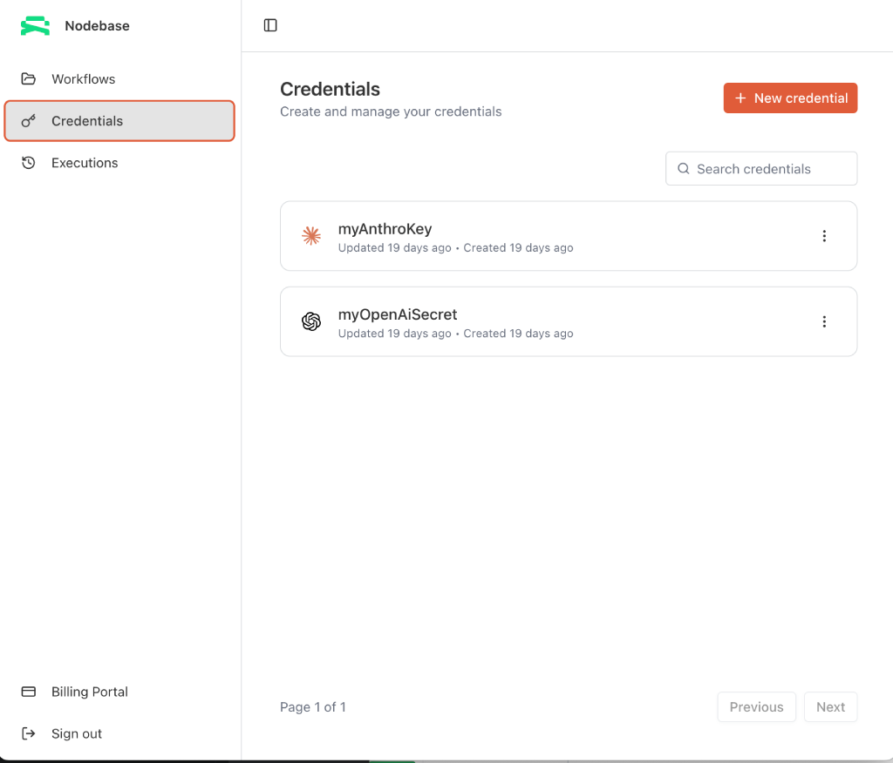
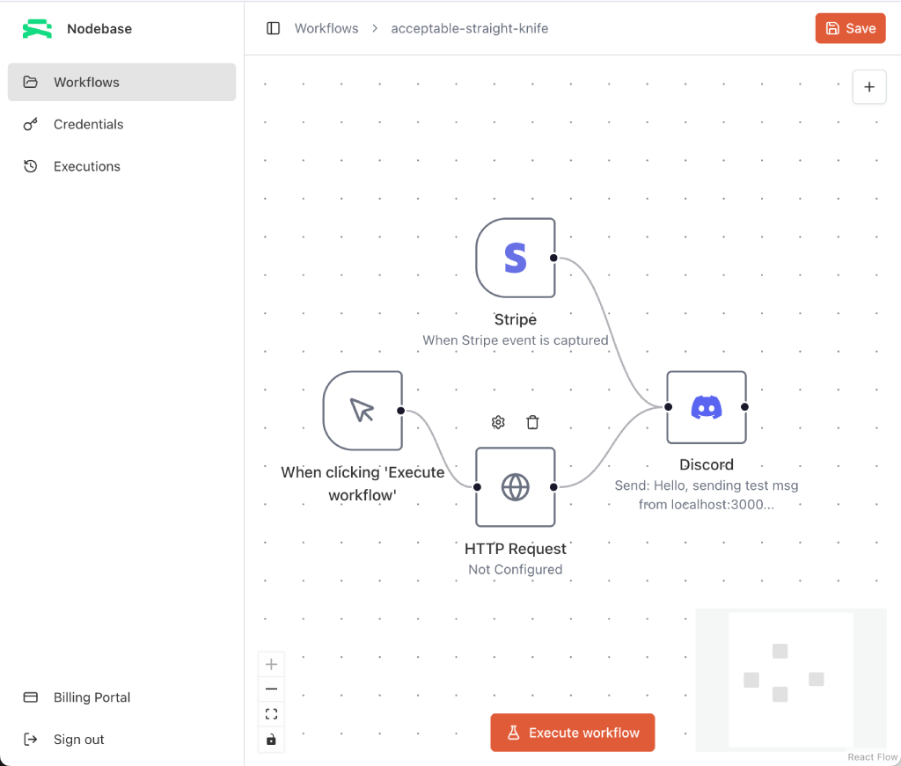
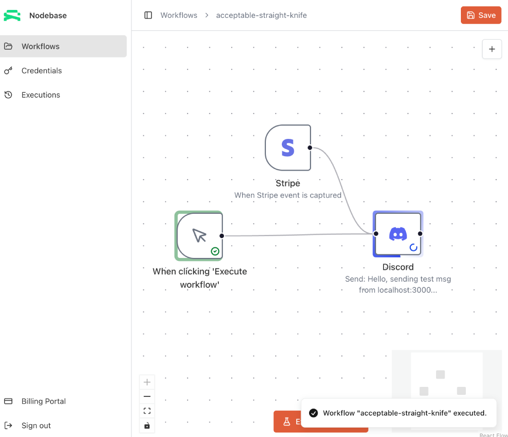
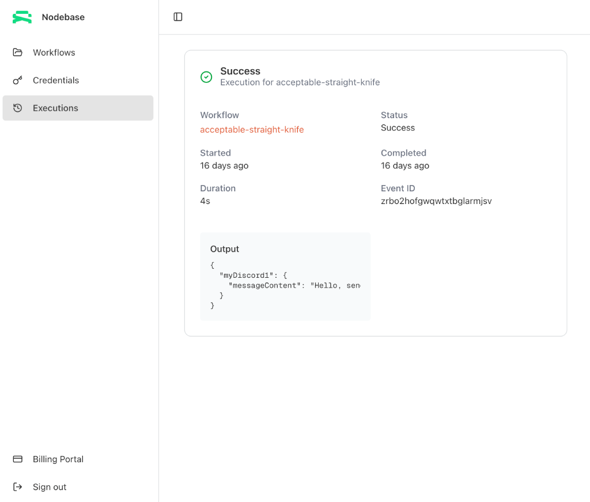
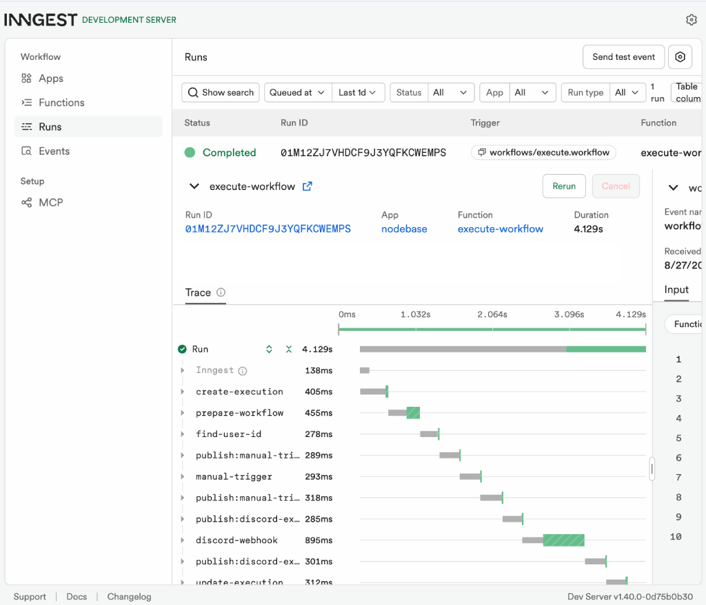
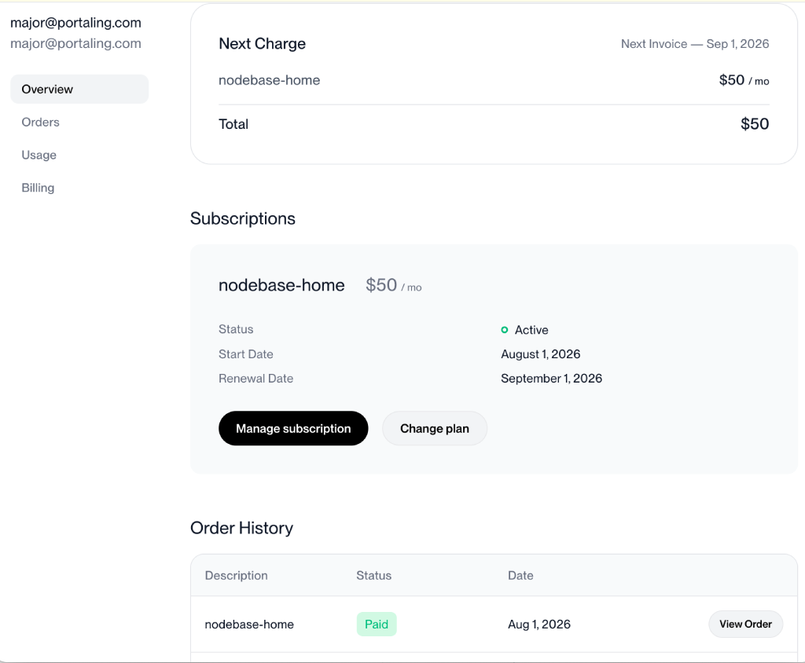

# &nbsp; **Realtime Drag-n-Drop Workflow Editor**   

### A complete SaaS product for workflow automation

## 💻 **Software Features this project has**
* Complete automation workflow editor
* Drag-n-drop canvas with trigger and execution nodes
* Realtime execution monitoring with web-sockets
* User creation and authentication with Better-Auth, Github, Google
* Ai with Anthropic, OpenAi, and Gemini integrations
* Messaging apps with Discord and Slack integration
* Payment processing using Polar and Stripe integrations
* Webhooks for Google Forms submissions and Stripe payments
* Payment include free tiers and premium subscriptions
* Observability using Sentry for errors, Ai token tracing and monitoring 
* Form submission encryption for user API keys

## 🛠️ **Build with the following tech stack**
- [NextJS](https://nextjs.org) with Typescript
- [TanStack React Query](https://tanstack.com/) / [tRPC](https://trpc.io/)
- Styling with [Shadcn](https://ui.shadcn.com/), [TailwindCSS](https://tailwindcss.com/)
- Canvas with [React Flow](https://reactflow.dev/)
- [Prisma](https://www.prisma.io) Database ORM with Zod and [Neon](https://neon.com/)
- [Inngest](https://www.inngest.com/docs) for durable executions

## 🖊️ **Description**
Automation without the complexity. Build powerful workflows visually, connect the tools your business already uses, and let automation handle the repetitive work. This workflow editor gives engineers, CEOs, and founders a fast, intuitive way to turn manual processes into reliable, automated systems—without having to build and maintain every integration from scratch. The visual, drag-and-drop canvas makes workflows easy to understand, modify, and share, while still providing the flexibility technical teams expect from a serious automation platform.

## 🖥️ **Screenshots**
### User credentials for Ai platforms 



### Workflow canvas showing Stripe and Discord nodes



### Workflow canvas when execution is triggered


### User execution status page



### Inngest server dashboard showing completed execution



### User premium subscription payment page



## 🌲 **Project tree**
NextJS file-system based routing to map directory and file structures directly to URL path.

```text
.
├── prisma
|   ├── migrations
│   └── schema.prisma
├── public
│   └── logos
├── src
│   ├── app
│   ├── components
│   ├── config
│   ├── features
│   ├── generated
│   ├── hooks
│   ├── inngest
│   ├── lib
│   └── trpc
├── .env
├── .gitignore
├── next.config.ts
├── tsconfig.json
├── prisma.config.ts
├── package.json
└── README.md
```

## **Troubleshooting**
**Installation issues** - Did you check module version compatibility in package.json?  
└── Frequent updates to packages may break the entire applicaiton.

**Vendor API issues** - API key not detected or accepted?  
└── Ensure your registered the correct url with the vendor and placed your API key in the `.env` file.

**Database issues** - Did you configure neon and prisma properly?  
└── Most features use prisma ORM so ensure the `generated` folder is up-to-date by running `npx prisma generate`. The workflow executions use inngest so you will need to run `npm run inngest` located in package.json

**User authentication issues** - Did you configure Better-Auth properly?  


## 📫 Contact [@therutkat](https://x.com/therutkat)


